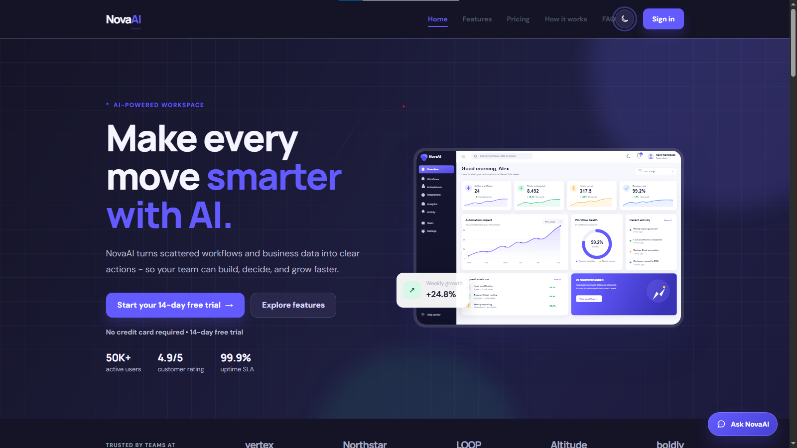
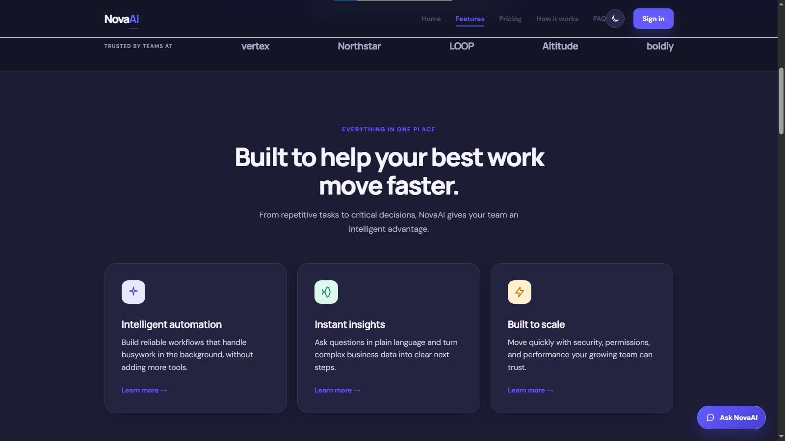
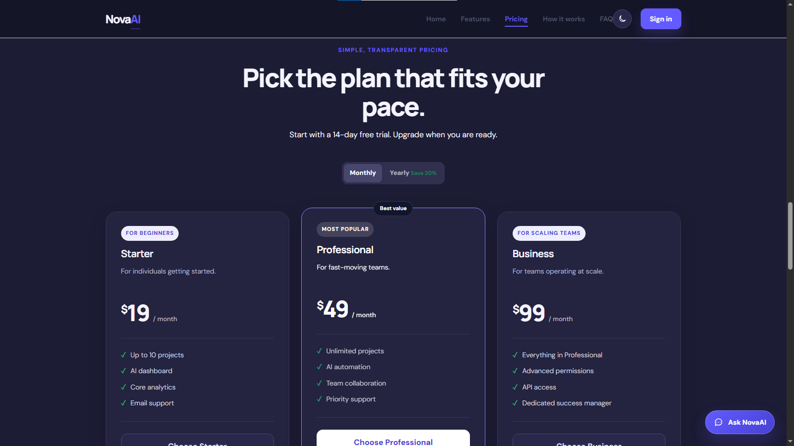
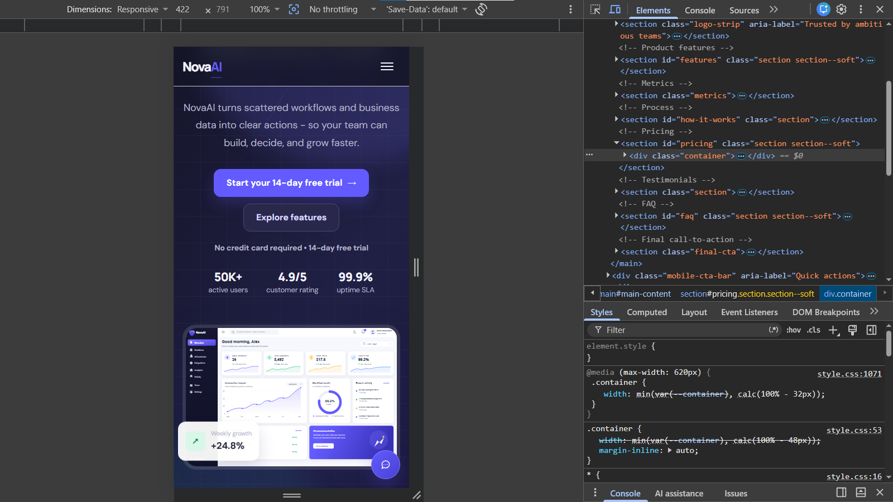

# Nova AI Automation

A modern and fully responsive AI SaaS landing page built with HTML5, Modern CSS3, and JavaScript.

Nova AI Automation is a frontend project focused on modern UI design, responsive layouts, interactive components, and creating a realistic SaaS product experience

## Live Demo 

[View Nova Ai Automation](https://nova-ai-automation.netlify.app/)

## 📸 Screenshots

### Dashboard



### Features



### How It Works


### Pricing



### Responsive



## Features

- Fully Responsive SaaS UI
- AI workspace & dashboard preview
- Create Account & Login UI
- Pricing plans & testimonials
- Dark mode
- Interactive AI chat widget
- Authentication & checkout UI
- Smooth animations & transitions

## Tech Stack 

- HTML5
- Modern CSS3
- JavaScript (ES6+)

## Project Structure

```text
nova-ai-automation/
├── index.html
├── css/
│   ├── main.css
│   ├── variables.css
│   └── responsive.css
├── js/
│   ├── main.js
│   ├── auth.js
│   ├── pricing.js
│   ├── checkout.js
│   └── chatbot.js
├── assets/
│   ├── images/
│   ├── icons/
│   └── fonts/
├── screenshots/
├── README.md
└── .gitignore
```

## Run Locally

Open `index.html` directly in a browser, or run a local server:

```bash
python -m http.server 8000
```

Then visit:

```text
http://localhost:8000
```

## Notes

This project was built to strengthen my skills in frontend development, responsive design, UI/UX, and JavaScript while creating a realistic SaaS product experience.

## Author

- My Portfolio: [Syed Furqan Ullah](https://syed-furqan-ullah-portfolio.netlify.app/)
- GitHub: [@syedfurqanullah](https://github.com/syedfurqanullah)
- LinkedIn: [Syed Furqan Ullah](https://www.linkedin.com/in/syed-furqan-ullah/)
